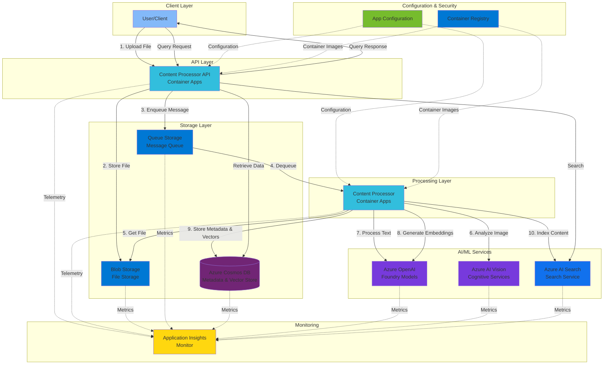

# Multi-Modal Content Processing Architecture - Specifications

## Overview

This document describes the architecture for a multi-modal content processing solution on Azure. The system is designed to handle file uploads, process various content types (text, images, video, audio), extract insights using AI services, and store the results for querying and retrieval.

## Architecture Components

### 1. Storage Layer

#### Blob Storage
- **Purpose**: Primary storage for uploaded files and processed content
- **Function**: Acts as the entry point for file uploads and stores raw and processed content
- **Integration**: Triggers downstream processing workflows

#### Queue Storage
- **Purpose**: Message queue for asynchronous processing
- **Function**: Decouples upload operations from processing, enabling scalable and resilient workflows
- **Pattern**: Implements producer-consumer pattern for workload distribution

#### Azure Cosmos DB
- **Purpose**: NoSQL database for storing metadata, processing state, and indexed content
- **Function**: 
  - Stores document metadata and processing status
  - Enables fast queries for content retrieval
  - Supports vector search for semantic similarity
- **Data Model**: 
  - Document-based structure
  - Hierarchical partition keys for scale and query efficiency
  - Embedded metadata for quick access patterns

### 2. Compute Layer

#### Container Apps (Content Processor)
- **Purpose**: Serverless compute for processing uploaded content
- **Function**: 
  - Dequeues messages from Queue Storage
  - Orchestrates AI service calls
  - Coordinates data flow between services
- **Scaling**: Auto-scales based on queue depth and CPU/memory utilization
- **Architecture**: Event-driven microservice pattern

#### Container Apps API (Content Processor API)
- **Purpose**: RESTful API for content submission and retrieval
- **Function**:
  - Accepts file uploads
  - Provides query endpoints for processed content
  - Manages processing status and monitoring
- **Endpoints**:
  - `POST /upload` - File upload endpoint
  - `GET /status/{id}` - Processing status
  - `GET /content/{id}` - Retrieve processed content
  - `POST /query` - Search and retrieve content

### 3. AI/ML Services

#### Azure OpenAI (Foundry Models)
- **Purpose**: Large language model processing and embeddings generation
- **Capabilities**:
  - Text analysis and summarization
  - Embedding generation for semantic search
  - Content classification and extraction
  - Multi-modal understanding (GPT-4 Vision)
- **Models**: GPT-4, GPT-4 Vision, text-embedding-ada-002

#### Azure AI Vision (Cognitive Services)
- **Purpose**: Computer vision processing
- **Capabilities**:
  - Image analysis and tagging
  - OCR (Optical Character Recognition)
  - Object detection
  - Face detection and recognition
  - Scene understanding

#### Azure AI Search
- **Purpose**: Enterprise search and retrieval
- **Function**:
  - Full-text search across processed content
  - Vector search for semantic similarity
  - Faceted search and filtering
  - Indexing of multi-modal content
- **Features**: Hybrid search (keyword + semantic)

### 4. Configuration & Security

#### App Configuration
- **Purpose**: Centralized configuration management
- **Function**: 
  - Stores application settings and feature flags
  - Provides dynamic configuration updates
  - Manages environment-specific settings
- **Integration**: Used by Container Apps for runtime configuration

#### Azure Key Vault
- **Purpose**: Secrets and credentials management
- **Function**:
  - Stores API keys for AI services
  - Manages connection strings
  - Provides certificate storage
- **Access**: Managed Identity-based authentication

#### Container Registry
- **Purpose**: Container image storage and distribution
- **Function**: 
  - Hosts container images for Container Apps
  - Supports CI/CD pipelines
  - Provides vulnerability scanning

### 5. Monitoring & Observability

#### Application Insights (Monitor)
- **Purpose**: Application performance monitoring and diagnostics
- **Function**:
  - Tracks processing metrics and performance
  - Captures logs and telemetry
  - Provides alerting and diagnostics
  - Monitors API usage and latency
- **Metrics**: 
  - Processing time per file type
  - AI service latency and token usage
  - Queue depth and processing rate
  - Error rates and exceptions

## Workflow Description

### Processing Flow

1. **Upload File**
   - User uploads file via Content Processor API
   - File is stored in Blob Storage
   - Message is enqueued to Queue Storage

2. **Dequeue**
   - Content Processor (Container App) dequeues message
   - Retrieves file from Blob Storage
   - Initiates processing pipeline

3. **Content Analysis**
   - For images: Azure AI Vision extracts tags, objects, OCR text
   - For text: Azure OpenAI performs analysis and summarization
   - For mixed content: Multi-modal processing with GPT-4 Vision

4. **Embedding Generation**
   - Azure OpenAI generates vector embeddings
   - Embeddings stored in Cosmos DB for vector search
   - Indexed in Azure AI Search

5. **Metadata Storage**
   - Processing results stored in Cosmos DB
   - Document metadata indexed
   - Processing status updated

6. **Indexing**
   - Content indexed in Azure AI Search
   - Enables full-text and semantic search
   - Supports faceted queries

7. **Monitor**
   - Application Insights tracks all operations
   - Logs and metrics captured
   - Alerts triggered on errors

8. **Update Process**
   - Status updates written to Cosmos DB
   - Clients can query processing status
   - Completed results available via API

## Architecture Diagram



## Data Flow

### Sequential Processing Steps

1. **Upload File** - User uploads content via API
2. **Store File** - File saved to Blob Storage
3. **Enqueue Message** - Processing message added to Queue
4. **Dequeue** - Processor picks up message from Queue
5. **Get File** - Processor retrieves file from Blob Storage
6. **Analyze Image** - Vision service processes visual content
7. **Process Text** - OpenAI analyzes and summarizes text
8. **Generate Embeddings** - OpenAI creates vector embeddings
9. **Store Metadata** - Results saved to Cosmos DB
10. **Index Content** - Content indexed in AI Search

### Query Flow

```
User → API (Query) → AI Search (Full-text/Vector Search)
                  → Cosmos DB (Metadata Retrieval)
                  → API Response → User
```

## Technical Specifications

### Scalability
- **Container Apps**: Auto-scale 0-30 instances based on queue depth
- **Cosmos DB**: Autoscale RU/s (400-4000 default)
- **AI Services**: Standard tier with regional deployment
- **Queue Storage**: Supports up to 2000 messages/second per queue

### Availability
- **SLA Target**: 99.9% uptime
- **Multi-region**: Consider geo-replication for Cosmos DB
- **Retry Policies**: Exponential backoff for AI service calls
- **Circuit Breaker**: Implement for external service dependencies

### Security
- **Authentication**: Azure AD/Entra ID integration
- **Authorization**: Role-Based Access Control (RBAC)
- **Network**: Private endpoints for all Azure services
- **Encryption**: At-rest and in-transit encryption
- **Managed Identity**: Service-to-service authentication

### Performance
- **API Latency**: < 100ms for status queries
- **Processing Time**: 
  - Images: 2-5 seconds
  - Documents (< 10 pages): 5-15 seconds
  - Large documents: 30-60 seconds
- **Throughput**: 100+ files/minute with auto-scaling

## Cost Optimization

- **Cosmos DB**: Use hierarchical partition keys to stay within free tier where possible
- **Container Apps**: Scale to zero when idle
- **AI Services**: Batch processing to optimize token usage
- **Storage**: Lifecycle policies for archiving old content
- **Reserved Instances**: Consider for predictable workloads

## Deployment Considerations

### Infrastructure as Code
- Use Bicep modules from catalog
- Implement modular deployment
- Version control for infrastructure

### CI/CD Pipeline
- Container build and push to ACR
- Automated testing before deployment
- Blue-green deployment for Container Apps

### Monitoring
- Set up custom dashboards in Application Insights
- Configure alerts for:
  - Queue depth thresholds
  - AI service errors
  - Processing failures
  - High latency

## Use Cases

1. **Document Processing**: Extract text, entities, and insights from PDFs and documents
2. **Image Analysis**: Automatic tagging, object detection, and OCR from images
3. **Content Moderation**: AI-powered content screening and classification
4. **Knowledge Base**: Build searchable knowledge repository with semantic search
5. **Multi-modal Search**: Search across text, images, and extracted content

## Future Enhancements

- Video processing with Azure Media Services
- Audio transcription with Speech Services
- Real-time streaming processing
- Custom vision models for domain-specific tasks
- RAG (Retrieval-Augmented Generation) pattern implementation
- Multi-language support
- Advanced analytics and reporting

## References

- [Azure Container Apps Documentation](https://learn.microsoft.com/azure/container-apps/)
- [Azure Cosmos DB Best Practices](https://learn.microsoft.com/azure/cosmos-db/)
- [Azure OpenAI Service](https://learn.microsoft.com/azure/ai-services/openai/)
- [Azure AI Vision](https://learn.microsoft.com/azure/ai-services/computer-vision/)
- [Azure AI Search](https://learn.microsoft.com/azure/search/)

---

**Version**: 1.0  
**Last Updated**: January 15, 2026  
**Maintained By**: Architecture Team
